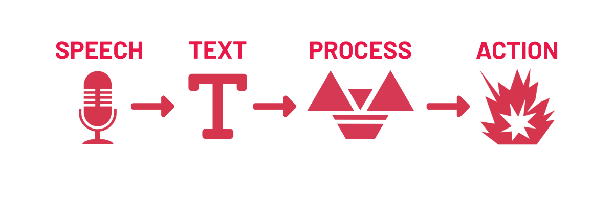

# wingman-ai

Wingman AI allows you to talk to various AI providers and LLMs (like ChatGPT) via your voice, process your conversations and finally trigger actions.

The idea is pretty simple but the possibilities are endless. You could for example:

- role-play with an AI while gaming for more immersion. Think _ATC_ in _Star Citizen_ or _Flight Simulator_
- enrich your gaming experiece with external data like APIs, databases, wikis or build guides
- trigger existing keybindings in games or programs
- have conversational tuturials and walkthroughs alongside your games or tools
- automate tasks on your computer
- accessibility
- ...

We presented an early prototype of Wingman AI in _Star Citizen_ on YouTube, which caused a lot of excitement and interest in the community:

Please note that Wingman is **NOT** limited to _Star Citizen_.

It is an external, universal tool that you can run alongside any game or program. Therefore, it does not currently interact directly with _Star Citizen_ or any game, other than its ability to trigger system-wide keypresses, which of course might have an effect on the game.
If you find a way to interact with a game, either via an API or by reading the game's memory, you could however use it to trigger actions in the game directly or to feed your models with live data.

The projects targets two different groups of users:

- Developers who want to build their own Wingmen
- Non-developers who want to use and modify existing Wingmen

We try to make it as easy as possible for both groups to get started. If you're a developer, you can just clone the repository and start building your own Wingman. If you're not a developer, you can start with pre-built Wingman from us or the community and [tweak them](#configure-wingmen) to your needs.

## Run Wingman on your computer

### Windows

You can "just run" Wingman AI on Windows using the release package we provide. It's a bundled executable that has all the required dependencies included.

Before you get too excited and see it fail on first attempt, open `config.yaml` and fill in your API key(s). Please read the [config section](#configure-wingmen)!

### MacOS

We don't have a ready-to-go package for you yet, sorry. It **does** run on MacOS though, most of us even develop on MacOS.

The easiest way for now is to setup your development environment like described below and to run it from source.

## Configure Wingmen

All user-specific settings are stored in [config.yaml](https://github.com/ShipBit/wingman-ai/blob/documentation/config.example.yaml). We added several preconfigured Wingmen to show you a wide variety of examples and to get you started quickly. Read the documentation in the file for more information.

The minimal change you have to make is to provide your [OpenAI API key](https://platform.openai.com/account/api-keys) for the preconfigured Wingmen. Search for `YOUR_API_KEY` in the config file and replace all occurences with your key.

## Set up your development environment

Are you ready to build your own Wingman or to bring a new feature to the framework? Great! We really appreciate your help. Please follow our guides to get started:

- [Windows](docs/develop-windows.md)
- [MacOS](docs/develop-macos.md)
